Now that we have our networks created, we can deploy virtual machines and ensure we can get an IP address from DHCP. Go ahead and Login into your AVS vCenter.

## Exercise 1: Create a content Library
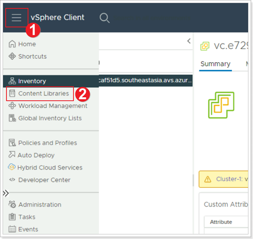

1.  From AVS vCenter, click the **Menu** bars.

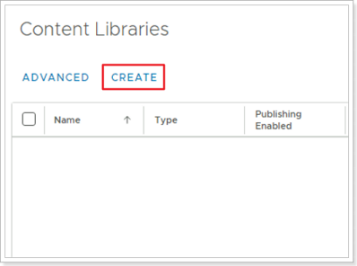

Click **CREATE**

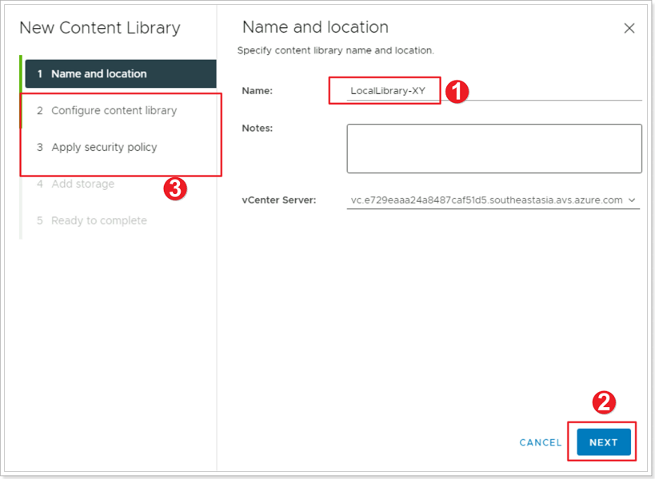

1. Name your Library **LocalLibrary-XY** where X is your group number and Y is your participant number
2. Click **NEXT**
3. Leave the defaults for **Configure content library** and for **Appy security policy**

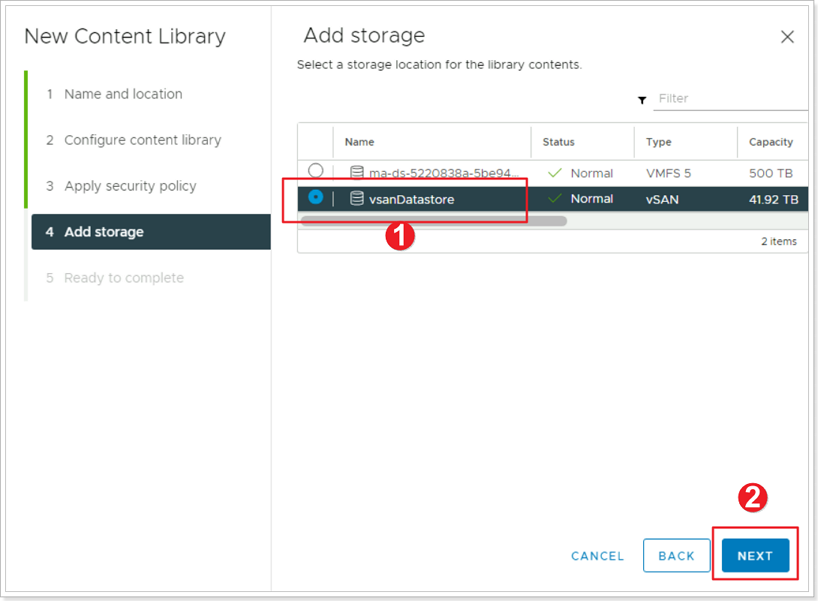

1. For **Add storage** select the**vsanDatastore**
2. Click **NEXT** then **FINISH**

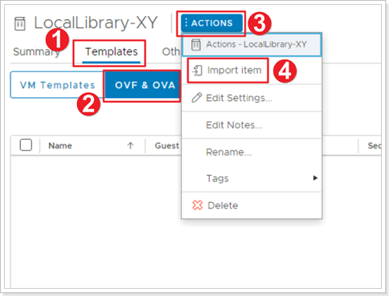

1. Click on your newly created Library and click **Templates**.
2. Click **OVF & OVA Templates**
3. Click **ACTIONS**
4. Click **Import item**

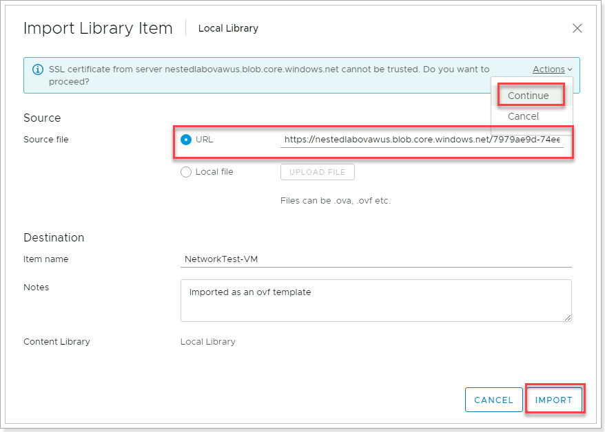

Import using this URL - [Download Link](https://gpsusstorage.blob.core.windows.net/ovas-isos/workshop-vm.ova)

<https://gpsusstorage.blob.core.windows.net/ovas-isos/workshop-vm.ova>

This will now download and import the VM to the library

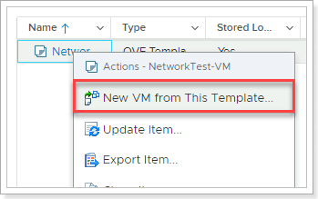

## Exercise 2 : Create the VM

Once downloaded, Right-click the VM Template \> **New VM from This Template**.

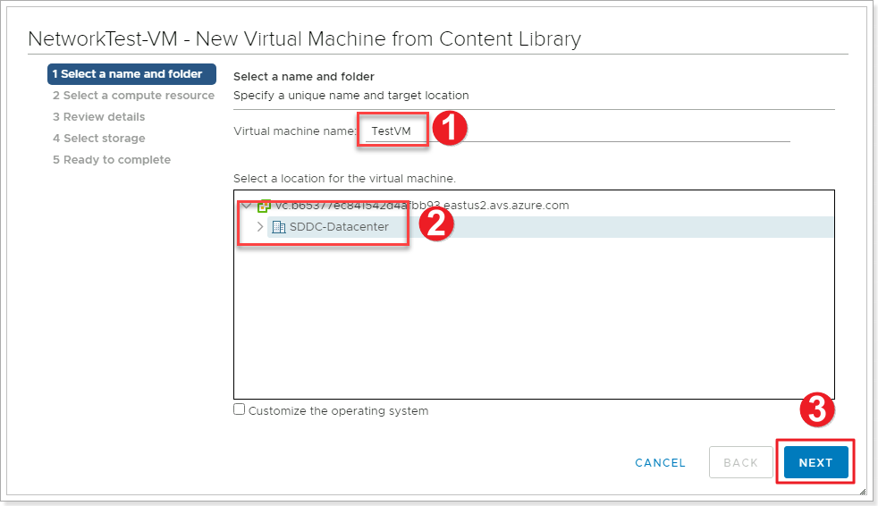

1. Give the VM a name – e.g **VM1-AVS-XY**
2. Select the **SDDC-Datacenter**
3. Click **NEXT**

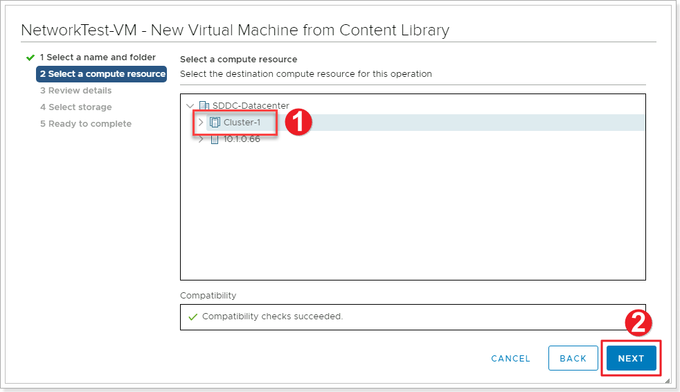

1. Select **Cluster-1**
2. Click **NEXT**

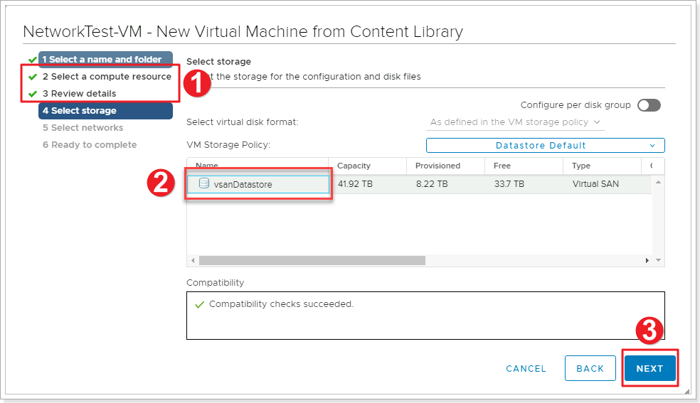

1. Review **Details** and click **NEXT**. Accept the terms and click **NEXT**
2. Confirm the storage as the **vsanDatastore**
3. Click **NEXT**

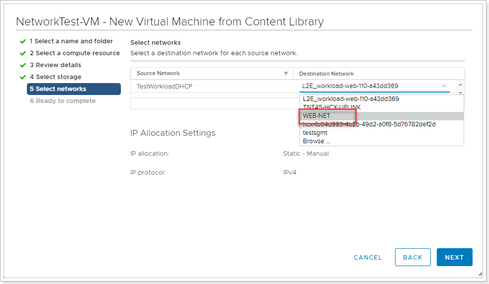

Select the segment that you created previously- **“WEB-NET-GROUP-XY”** and click **NEXT**. Then review and click **FINISH**.

Once deployed, head back to VM’s and Templates and Power On this newly created VM. This VM is provided as a very lightweight Linux machine that will automatically pick up DHCP if configured. Since we have added this to the **WEB-NET-GROUP-XY** segment, it should get an IP address from this DHCP range. This usually takes few seconds. Click the “Refresh” button on vCenter toolbar.

If you see an IP address here, we have successfully configured the VM and it has connected to the segment and will be accessible from the Jumpbox.

We can confirm this by SSH'ing to this IP address from the Jumpbox.

> Username: root

> Password: AVSR0cks!

**YOU MAY BE ASKED TO CHANGE THE PASSWORD OF THE ROOT USER ON THE VM, CHANGE IT TO A PASSWORD OF YOUR CHOOSING, JUST REMEMBER WHAT THAT PASSWORD IS.**

Once you SSH into the VMs, enter these 2 commands to enable ICMP traffic on the VM:

`iptables -A OUTPUT -p icmp -j ACCEPT`

`iptables -A INPUT -p icmp -j ACCEPT`

> PLEASE REPEAT THESE STEPS AND CREATE A SECOND VM CALLED 'VM2-AVS-XY'

