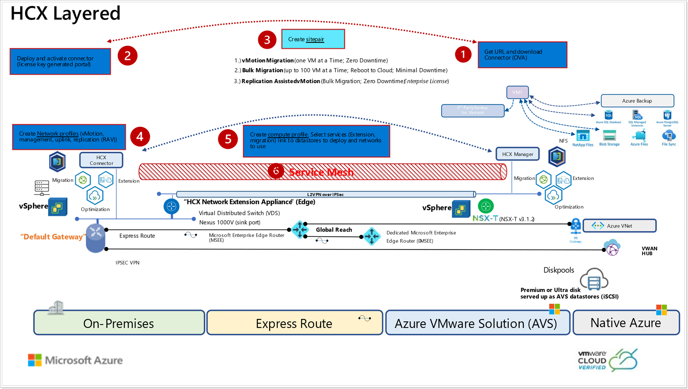

## **Introduction to VMware HCX**

VMware HCX™ is an application mobility platform designed for simplifying application migration, workload rebalancing and business continuity across data centers and clouds. HCX supports the following types of migrations:

-   Cold Migration - Offline migration of VMs.

-   Bulk Migration - scheduled bulk VM (vSphere, KVM, Hyper-V) migrations with reboot – low downtime.

-   HCX vMotion - Zero-downtime live migration of VMs – limited scale.

-   Cloud to Cloud Migrations – direct migrations between VMware Cloud SDDCs moving workloads from region to region or between cloud providers.

-   OS Assisted Migration – bulk migration of KVM and Hyper-V workloads to vSphere (HCX Enterprise feature).

-   Replication Assisted vMotion - Bulk live migrations with zero downtime combining HCX vMotion and Bulk migration capabilities (HCX Enterprise feature).

In this module, we will go through the steps to Install HCX, configure and migrate a test VM to Azure VMware Solution (AVS).

>For more information on HCX, please visit [VMware's HCX Documentation.](https://www.vmware.com/products/hcx.html)

## **HCX Setup for Azure VMware Solution (AVS)**

### **Prerequisites**

- Ensure that Module 1 has been completed successfully as this will be required to connect HCX from AVS to the On-Premises Lab. 

- Jumphost from AVS should be able to ping following ip addresses:

    -   AVS vCenter: get from the Azure Portal

    -   On-prem vCenter: 10.**X**.**Y**.2

> Remember that **X** is your group number and **Y** your participant number.

-   Review HCX documentation on VMware's site: [VMware HCX User Guide.](https://docs.vmware.com/en/VMware-HCX/4.0/hcx-user-guide/GUID-BFD7E194-CFE5-4259-B74B-991B26A51758.html)

