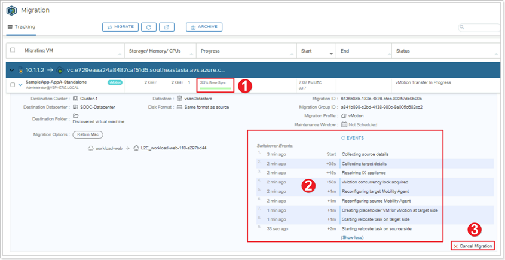

## **Migrate a VM using HCX vMotion**

Now that your Service Mesh has deployed the additional appliances HCX will utilize successfully, you can now migrate VMs from your on-premises environment to AVS. In this module, you will migrate a test VM called **SampleApp-AppA-Standalone** that has been pre-created for you in your simulated on-premises environment using HCX vMotion.

### **Exercise 1: Migrate VM to AVS**

#### Step 1: Examine VM to be migrated

1. Click the **VMs and Templates** icon in your on-premises vCenter Server.
2. Under the folder called **Workloads** you will find the VM named **SampleApp-AppA-Standalone**, select it.
3. Notice the IP address assigned to the VM, this should be consistent with the network you stretched using HCX in a previous exercise.
4. Notice the name of the Network this VM is connected to: **workload-web**.

#### Step 2: Access HCX Interface

1. From the vCenter Server interface, click **Menu**.
2. Click **HCX**.

> You can also access the HCX interface by using its standalone interface (outside vCenter Server interface) by opening a browser tab to: https://10.X.Y.9, where **X** is your group number and **Y** is your participant number.

#### Step 3: Initiate VM Migration

1. From the HCX interface click **Migration** in the left pane.
2. Click **MIGRATE**.

#### Step 4: Select VMs for Migration

1. Click **Workloads** to navigate to the location of your VM.
2. Click the checkbox to select your VM named **SampleApp-AppA-Standalone**.
3. Click **ADD**.

#### Step 5: Transfer and Placement of VM on Destination Site

**Transfer and Placement** options can be entered in 2 different ways:
1. If you've selected multiple VMs to be migrated and all VMs will be placed/migrated with the same options, setting the options in the area with the green background will set the options for all VMs.
2. To set the options individually per VM can be set and they can be different from each other.
3. Click either **GO** or **VALIDATE** button. Clicking **VALIDATE** will validate that the VM can be migrated (This will not migrate the VM). Clicking **GO** will both validate and migrate the VM.

Use the following values for these options:

|       Option       |    Value                   |
|--------------------|----------------------------|
| Compute Container  | Cluster-1                  |
| Destination Folder | Discovered virtual machine |
| Storage            | vsanDatastore              |
| Format             | Same format as source      |
| Migration Profile  | vMotion                    |
| Switchover Schedule | N/A                       |

#### Step 6: Monitor VM Migration

As you monitor the migration of your VM, keep an eye on the following areas:
1. Percentage status of VM migration.
2. Sequence of events as the migration occurs.
3. **Cancel Migration** button.

#### Step 7: Verify Completion of VM Migration

Ensure your VM was successfully migrated. You can also check for the VM in your AVS vCenter to Ensure it was migrated.

#### Step 8: Reverse Migration

VMware HCX also supports **Reverse Migration**, migrating from AVS back to on-premises. 

> **IMPORTANT** - All migrations, including reverse migrations must be initiated from the source site (on-premises in this case).

1. Click **Reverse Migration** checkbox.
2. Select the **Discovered virtual machine** folder.
3. Select your same virtual machine to migrate back to on-premises.
4. Click **ADD**.

The rest of the steps are similar to what you did on Step 5.

